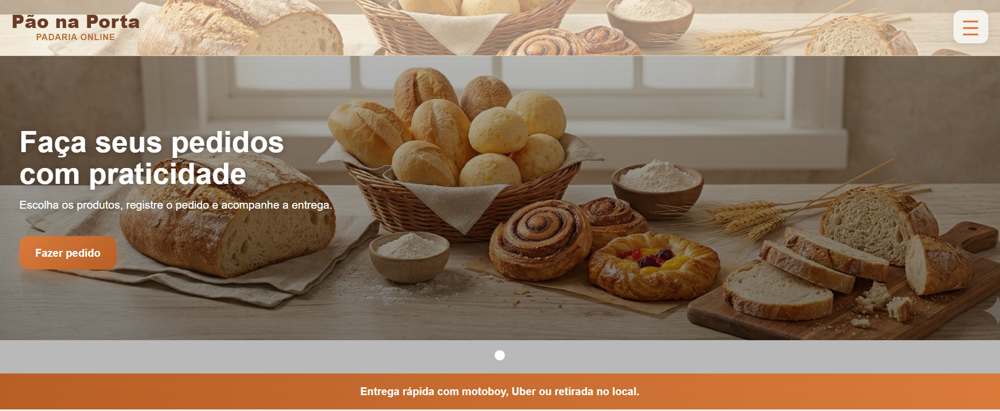
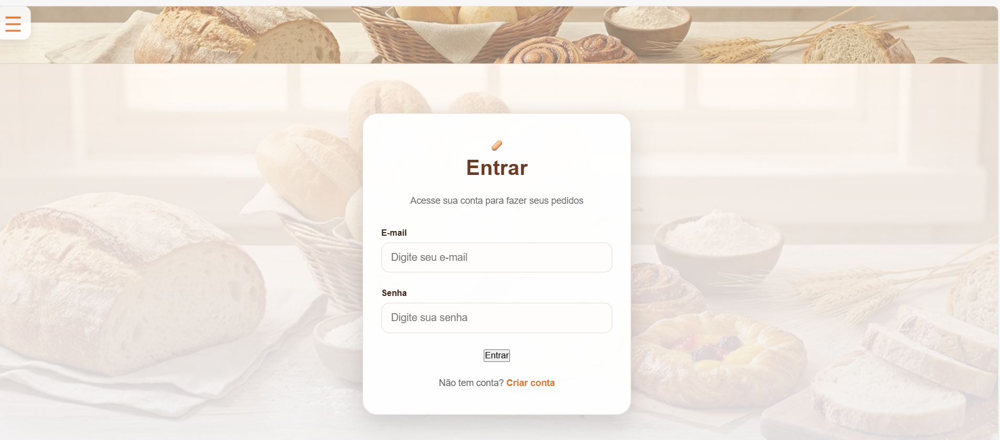
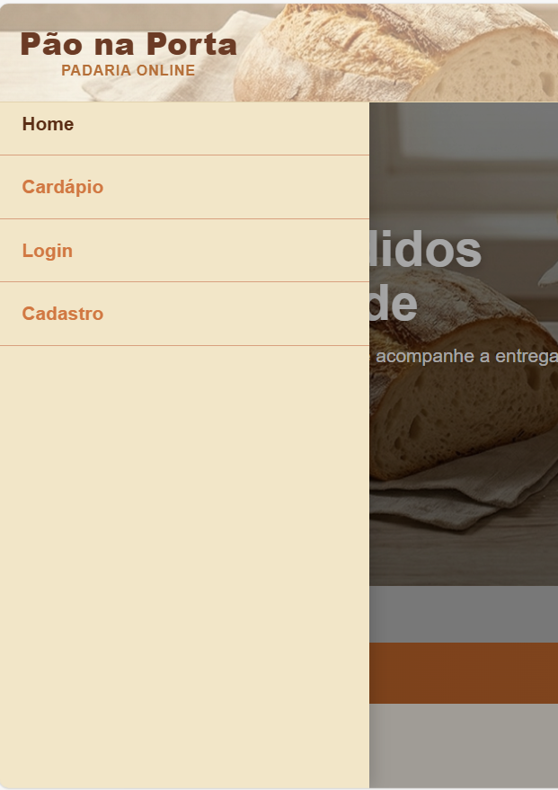

# 🥖 Pão na Porta — Sistema de Pedidos Online

## 📌 Sobre o projeto
Aplicação web desenvolvida com Flask que simula o fluxo de pedidos de uma padaria, permitindo que clientes realizem pedidos e acompanhem seu status, enquanto o administrador gerencia e atualiza os pedidos em tempo real.

---

## 🌐 Acesso ao sistema
👉 https://drp14-2026.onrender.com/

---

## ⚙️ Funcionalidades

### 👤 Área do Cliente
- Cadastro e autenticação de usuários  
- Criação de pedidos com seleção de produtos e quantidade  
- Visualização de pedidos realizados  
- Acompanhamento do status do pedido  

### 🏪 Área Administrativa
- Visualização de todos os pedidos  
- Atualização do status dos pedidos (ex: recebido, em preparo, entregue)  

---

## 🧪 Tecnologias utilizadas
- Python  
- Flask  
- HTML / CSS  
- SQLite  

---

## 🚀 Deploy
Aplicação publicada em ambiente cloud utilizando **Render**, com deploy integrado ao GitHub.

---

## 🧠 Diferenciais do projeto
- Implementação de fluxo completo (cliente + administrador)  
- Aplicação web funcional com lógica de negócio real  
- Integração entre backend (Flask) e interface web  
- Deploy em produção acessível via internet  

---

## 💡 Aprendizados
- Desenvolvimento de aplicações web com Flask  
- Estruturação de rotas, templates e lógica de backend  
- Manipulação de formulários e dados  
- Implementação de regras de negócio  
- Publicação de aplicação em ambiente cloud  

## 📷 Screenshots

### 🏠 Tela inicial
 

### 🔐 Tela de login

### 📋 Menu

