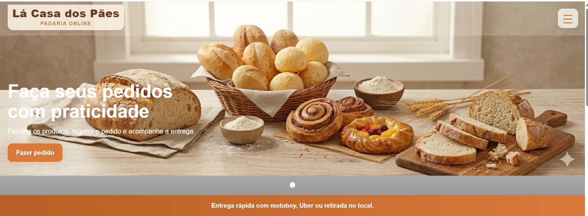

# 🥖 Lá Casa dos Pães — Sistema de Pedidos Online

## 📌 Sobre o projeto

Aplicação web desenvolvida com Flask que simula o fluxo de pedidos de uma padaria, permitindo que clientes realizem pedidos e acompanhem seu status, enquanto o administrador gerencia e atualiza os pedidos em tempo real.

O projeto foi desenvolvido com foco na aplicação prática de conceitos de desenvolvimento web full-stack, autenticação de usuários, banco de dados e integração entre backend e interface web.

---

## 🌐 Acesso ao sistema

👉 https://drp14-2026.onrender.com/

---

## ⚙️ Funcionalidades

### 👤 Área do Cliente

✔ Cadastro e autenticação de usuários  
✔ Login e logout  
✔ Visualização do cardápio com imagens  
✔ Criação de pedidos com seleção de produtos e quantidade  
✔ Visualização dos pedidos realizados  
✔ Acompanhamento do status do pedido  
✔ Área de perfil  
✔ FAQ integrado ao sistema  
✔ Sistema de notificações  

---

### 🏪 Área Administrativa

✔ Visualização de todos os pedidos  
✔ Atualização do status dos pedidos  
✔ Gerenciamento do fluxo dos pedidos  
✔ Controle administrativo centralizado  

---

## 🧪 Tecnologias utilizadas

- Python
- Flask
- HTML5
- CSS3
- JavaScript
- Jinja2
- SQLite
- Git
- GitHub
- Render

---

## 📂 Estrutura do projeto

```bash
DRP14_2026/
│
├── static/
│   ├── img/
│   └── style.css
│
├── templates/
│   ├── base.html
│   ├── home.html
│   ├── login.html
│   ├── cadastro.html
│   ├── cardapio.html
│   ├── perfil.html
│   ├── admin.html
│   ├── faq.html
│   └── ...
│
├── database.db
├── app.py
├── requirements.txt
└── README.md
```

---

## 🚀 Como executar localmente

Clone o projeto:

```bash
git clone https://github.com/jackyanunciada/DRP14_2026.git
```

Entre na pasta:

```bash
cd DRP14_2026
```

Instale as dependências:

```bash
pip install flask
```

Execute:

```bash
python app.py
```

Abra no navegador:

```bash
http://127.0.0.1:5000
```

---

## 🚀 Deploy

Aplicação publicada em ambiente cloud utilizando **Render**, com deploy integrado ao GitHub.

---

## 💡 Diferenciais do projeto

- Implementação completa de fluxo Cliente + Administrador
- Sistema funcional com regras reais de negócio
- Interface responsiva
- Cardápio dinâmico com imagens
- Sistema de autenticação
- Notificações de pedidos
- Aplicação disponível online

---

## 🧠 Aprendizados

- Desenvolvimento de aplicações web utilizando Flask
- Estruturação de rotas e templates
- Manipulação de banco de dados SQLite
- Desenvolvimento front-end com HTML/CSS
- Integração entre backend e interface
- Controle de versões com Git/GitHub
- Publicação em ambiente cloud

---

## 📷 Screenshots

### 🏠 Tela inicial



### 🥖 Cardápio

(Adicionar imagem)

### 🔐 Login

(Adicionar imagem)

### 🏪 Painel Administrativo

(Adicionar imagem)

---

## 👩‍💻 Desenvolvido por

Jaqueline Oliveira

Projeto Integrador — UNIVESP
